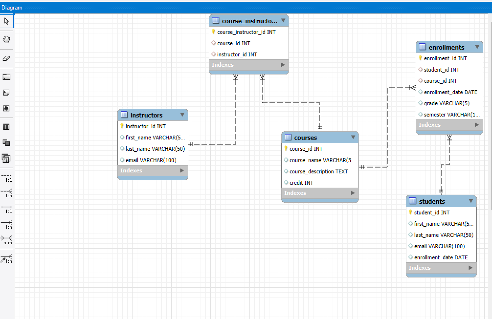

# Academic Student Record System

## Overview
This project is a relational database for tracking student enrollments, grades, and academic progress at a university. Built using MySQL and tested in MySQL Workbench, it supports CRUD operations and relationship queries.

## Technologies Used
- MySQL Workbench
- SQL (DDL + DML)
- GitHub
- YouTube (for demo)

## Features
- Manage students, courses, instructors
- Enroll students and record grades
- Query academic history and GPA
- Normalize tables to 3NF

## Entity-Relationship Diagram

## Tables
- Students
- Courses
- Instructors
- Enrollments
- Course_Instructors

## Resources Used
- [MySQL Documentation](https://dev.mysql.com/doc/)
- [W3Schools SQL](https://www.w3schools.com/sql/)
- [Learning SQL by Alan Beaulieu (Safari Books)](https://learning.oreilly.com/library/view/learning-sql-3rd/9781492057604/)
- [Programming with Mosh - SQL Full Course](https://www.youtube.com/watch?v=7S_tz1z_5bA)

## Author
Umah – CSE 310 | BYU-Idaho
